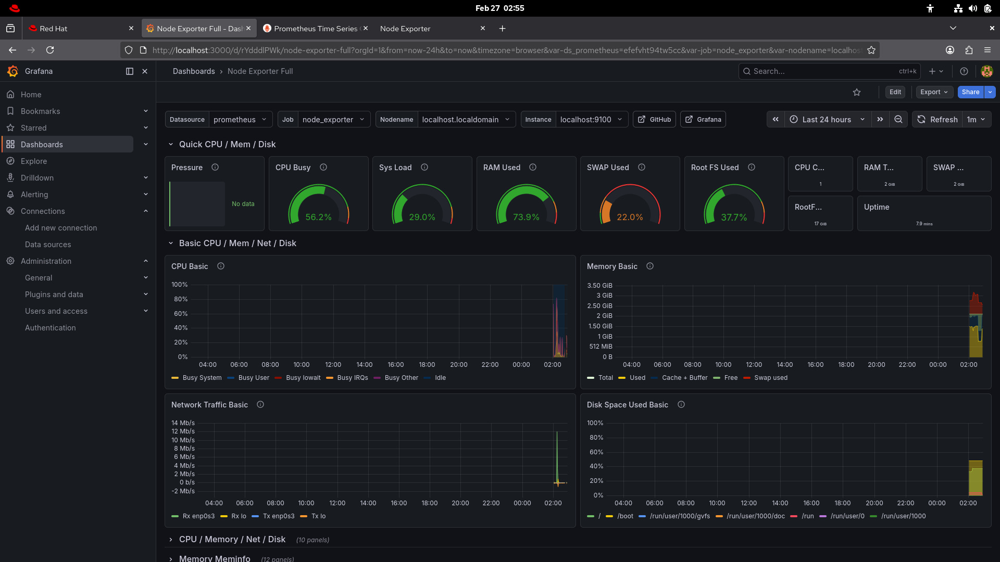
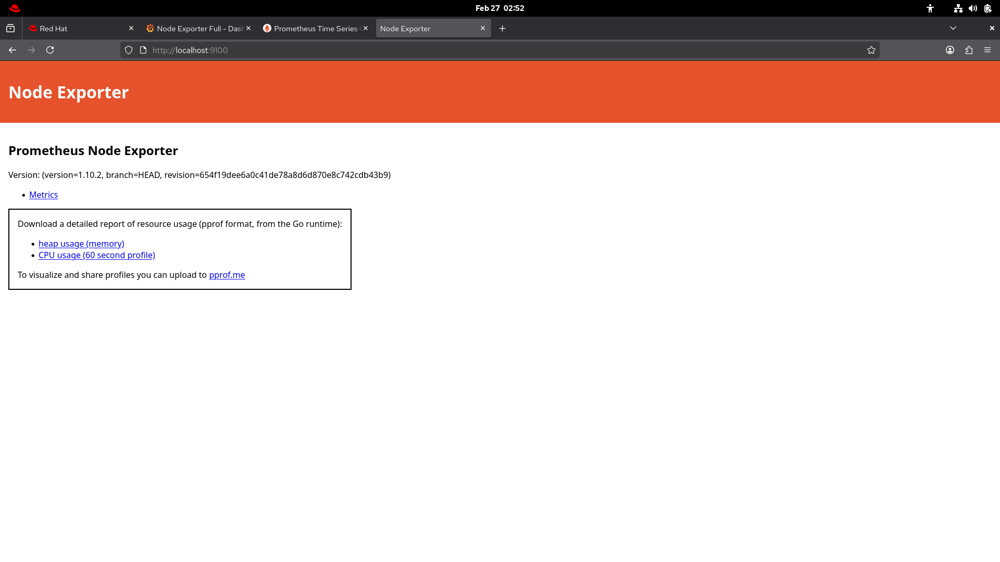
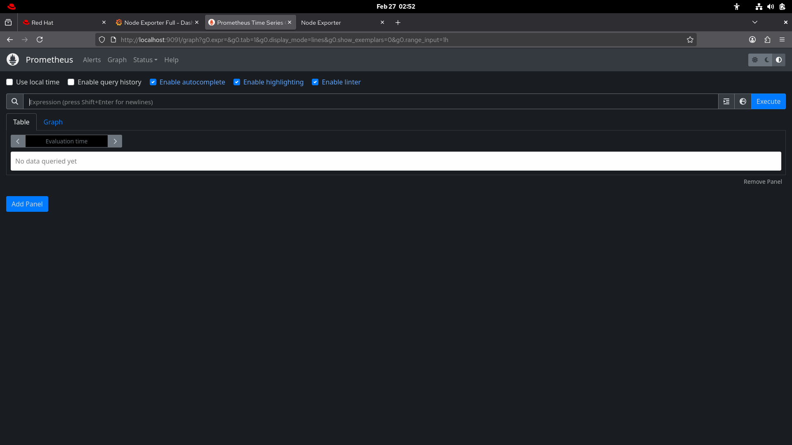

# 🚀 Self-Healing Linux Server

## 📖 Project Overview

The **Self-Healing Linux Server** is an automated monitoring and recovery system built using Bash scripting.  
It continuously monitors system services and disk usage every 5 minutes.

If:
- A critical service stops
- Disk usage exceeds threshold

The system will:
- Automatically restart the service
- Log the issue
- Send Telegram notification
- Send Email alert

Additionally, it integrates with:
- Prometheus
- Node Exporter
- Grafana

For real-time monitoring and visualization.

---

## 🎯 Objectives

- Automate Linux server monitoring
- Implement self-healing mechanism
- Provide real-time alerts
- Visualize system metrics
- Improve system reliability

---

## 🛠 Technologies Used

- Bash Scripting
- Cron Jobs
- Prometheus
- Node Exporter
- Grafana
- Telegram Bot API
- Linux (RHEL/CentOS)

---

## 🏗 Project Architecture

```
+------------------+      +------------------+      +------------------+
|  Node Exporter   | ---> |   Prometheus     | ---> |     Grafana      |
+------------------+      +------------------+      +------------------+

Self-Healing Script
        |
        v
Cron (Every 5 Minutes)
        |
        v
Telegram Alerts + Email Alerts
```

---

## 📂 Project Structure

```
self-healing-linux-server/
│
├── config.sh
├── disk_check.sh
├── service_check.sh
├── main.sh
│
├── monitoring/
│   └── prometheus.yml
│
└── screenshots/
```


---

## ⚙ Installation & Setup Guide

### 1️⃣ Clone Repository

```bash
git clone https://github.com/tejaskanade15/self-healing-linux-server.git
cd self-healing-linux-server
```

### 2️⃣ Make Scripts Executable

```bash
chmod +x *.sh
```

### 3️⃣ Configure Alert Settings

Edit `config.sh` and update:

- Disk threshold  
- Email address  
- Telegram Bot Token  
- Chat ID  

### 4️⃣ Setup Cron Job

```bash
crontab -e
```

Add this line:

```bash
*/5 * * * * /path/to/main.sh >> /var/log/cron_self_healing.log 2>&1
```

---

## 📊 Monitoring Stack Setup

### Install Node Exporter

```bash
sudo dnf install node_exporter -y
sudo systemctl enable node_exporter
sudo systemctl start node_exporter
```

Check in browser:  
http://localhost:9100/metrics

---

### Install Prometheus

Edit `prometheus.yml`:

```yaml
scrape_configs:
  - job_name: "node_exporter"
    static_configs:
      - targets: ["localhost:9100"]
```

Access:  
http://localhost:9090

---

### Install Grafana

```bash
sudo dnf install grafana -y
sudo systemctl enable grafana-server
sudo systemctl start grafana-server
```

Access:  
http://localhost:3000

Add Prometheus as Data Source  
Import Dashboard: **Node Exporter Full (ID: 1860)**

---

## 📊 Dashboard Screenshots

### 🔹 Grafana Monitoring Dashboard


### 🔹 Node Exporter Running


### 🔹 Prometheus Interface


---

## 📩 Alert System

The system sends alerts via:

- Telegram Bot API  
- Email Notifications  

### Alerts are triggered when:

- Disk usage exceeds defined threshold  
- A monitored service stops running  

---

## 📌 Conclusion

This project demonstrates automation, monitoring, and self-healing capabilities in Linux systems using open-source tools.

By integrating Bash scripting with Prometheus, Node Exporter, and Grafana, the system ensures:

- Improved server uptime  
- Reduced manual intervention  
- Real-time monitoring and alerting  
- Faster issue detection and recovery  

The Self-Healing Linux Server enhances reliability and operational efficiency in Linux-based environments.

---

## 👨‍💻 Authors

**Tejas Kanade**  
**Omkar Ghongde**  
**Godge Saiprasad**  

B.Tech CSE  
Major Project – Self Healing Linux Server


